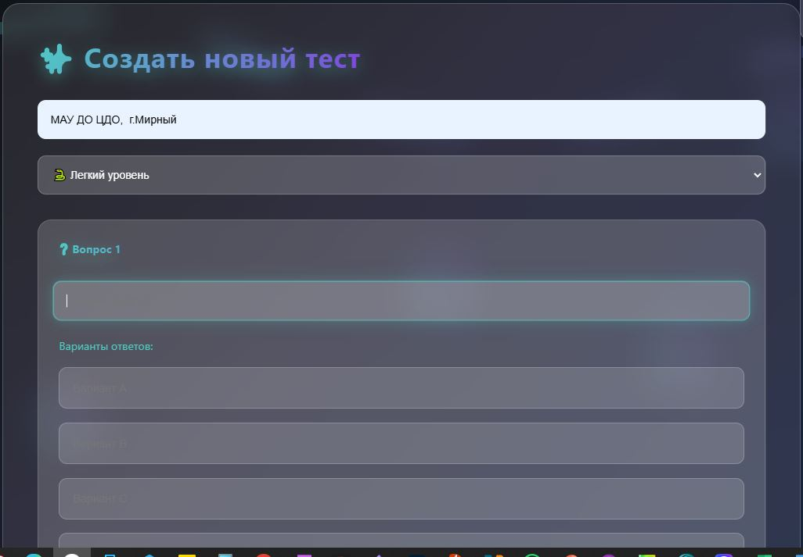

# **Проект "Уткер"**

## **1. Почему это важно и в чём проблема**

Сейчас учителя слишком много времени тратят на бумажную работу. По исследованиям, они проводят почти половину рабочего дня не за уроками, а за проверкой тетрадей, заполнением журналов и разными отчётами. Из-за этого:
* Учителя сильно устают и "выгорают"
* У них нет времени придумывать интересные уроки
* Учёба становится скучнее

Хорошие учителя уходят из школ
Мой проект "Уткер" (это слово значит "умный" на тюркских языках) поможет решить эти проблемы с помощью программирования - он будет автоматизировать рутинную работу.

## 2. Цель проекта

Создать удобный сайт, который:
* Сам будет проверять задания
* Генерировать тестовые вопросы для класса или группы
* Показывать статистику успеваемости в реальном времени
* Помогать учителям меньше уставать

## 3. Что нужно сделать по шагам

* Написать код для создания заданий
* Сделать систему автоматической проверки
* Создать личный кабинет для учителя
* Сделать удобное управление классами и расписанием
* Добавить аналитику и графики
* Научить программу делать автоматические отчёты
* Протестировать и исправить ошибки
* Попробовать использовать платформу в нашем ЦДО и в классе

## 4.Функциональные возможности

Для учителей:
* Конструктор заданий — создание индивидуальных или групповых заданий в 3 клика
* Автопроверка — мгновенная оценка тестов и текстовых ответов
* Статистика — подробная аналитика по каждому ученику и классу
* Библиотека заданий 

Для учащихся:
* Удобный и адаптивный интерфейс для выполнения заданий
* Мгновенная обратная связь с пояснениями по поводу ошибок
* Доступ с любого устройства (ПК, планшета, смартфона)

## 5. Техническая часть

Я сделал "Уткер" как веб-приложение на Python. Использовал библиотеки:
* Flask - для создания сайта
* SQLite3 - для базы данных
* JSON - для хранения информации

Сейчас основная часть кода готова, но ещё не всё работает идеально. Мне нужно время, чтобы:
* Изучить больше о веб-разработке
* Разобраться с обработкой ошибок
* Сделать интерфейс ещё удобнее
* Разобраться с выводом отчетов
* Настроить безопасность

